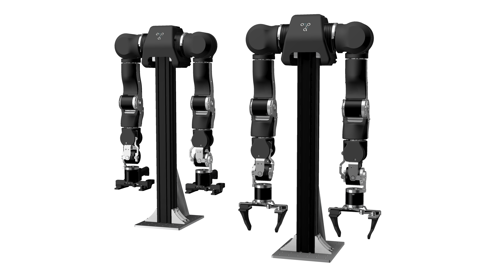

# OpenArm

**OpenArm** is an open-source 7DOF humanoid arm designed for physical AI research and deployment in contact-rich environments. With high backdrivability and compliance, it excels at safe human-robot interaction while delivering practical payload capabilities for real-world applications.

OpenArm features **human-scale** proportions, safety and compliance, and practical payloads. At $6,500 USD for a complete bimanual system, it provides a flexible platform for teleoperation, imitation learning, simulation, and real-world data collection in contact-rich tasks.

*We're in continuous development and actively seeking contributors, research partners, and company collaborators to shape the next generation of practical humanoid systems. Ready to join the future of open-source robotics?*

> ### 📦 Purchase Your OpenArm!
> Get your **OpenArm**, assembled or DIY, and join the global community!  
> Browse verified and certified manufacturers worldwide. 
> 
> [**Buy Now →**](https://docs.openarm.dev/purchase)

## ⭐ Star History

<a href="https://www.star-history.com/#enactic/openarm&type=date&legend=top-left">
 <picture>
   <source media="(prefers-color-scheme: dark)" srcset="https://api.star-history.com/svg?repos=enactic/openarm&type=date&theme=dark&legend=top-left" />
   <source media="(prefers-color-scheme: light)" srcset="https://api.star-history.com/svg?repos=enactic/openarm&type=date&legend=top-left" />
   
 </picture>
</a>

## 🔗 Quick Links

| Platform | Description | Link |
|----------|-------------|------|
| **Website** | Project homepage and media | [openarm.dev](https://openarm.dev) |
| **Documentation** | Complete technical guides | [docs.openarm.dev](https://docs.openarm.dev) |
| **Discord** | Community discussions | [Join Discord](https://discord.gg/FsZaZ4z3We) |
| **Contact** | Direct communication | [openarm@enactic.ai](mailto:openarm@enactic.ai) |

## 📁 Repositories

| Repository | Documentation | License | Description |
|------------|---------------|---------|-------------|
| **[openarm](https://github.com/enactic/openarm)** | [General Docs](https://docs.openarm.dev) | [Apache-2.0](LICENSE) | Main project repository with ideas, issues, and feature requests |
| **[openarm_hardware](https://github.com/enactic/openarm_hardware)** | [Hardware Docs](https://docs.openarm.dev/hardware) | [CERN-OHL-S-2.0](https://github.com/enactic/openarm_hardware/blob/main/LICENSE.txt) | Complete CAD data: STL files, STEP files, Fusion 360 assemblies |
| **[openarm_description](https://github.com/enactic/openarm_description)** | [Description Docs](https://docs.openarm.dev/api-reference/description/) | [Apache-2.0](https://github.com/enactic/openarm_description/blob/main/LICENSE.txt) | Robot description files with URDF/xacro for simulation |
| **[openarm_can](https://github.com/enactic/openarm_can)** | [CAN Docs](https://docs.openarm.dev/api-reference/can/) | [Apache-2.0](https://github.com/enactic/openarm_can/blob/main/LICENSE.txt) | CAN control library for low-level motor communication |
| **[openarm_ros2](https://github.com/enactic/openarm_ros2)** | [ROS2 Docs](https://docs.openarm.dev/api-reference/ros2/install) | [Apache-2.0](https://github.com/enactic/openarm_ros2/blob/main/LICENSE) | ROS2 integration packages and nodes |
| **[openarm_teleop](https://github.com/enactic/openarm_teleop)** | [Teleop Docs](https://docs.openarm.dev/teleop/) | [Apache-2.0](https://github.com/enactic/openarm_teleop/blob/main/LICENSE.txt) | Teleoperation packages with unilateral and bilateral control |
| **[openarm_isaac_lab](https://github.com/enactic/openarm_isaac_lab)** | [Isaac Docs](https://docs.openarm.dev/simulation/) | [Apache-2.0](https://github.com/enactic/openarm_isaac_lab/blob/main/LICENSE.txt) | Isaac Lab simulation environment and training tasks |

## 📄 Code of Conduct

All participation in the OpenArm project is governed by our [Code of Conduct](CODE_OF_CONDUCT.md).
