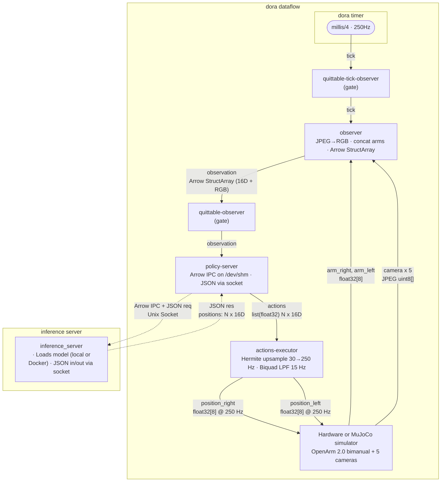

import BlockVideo from '@site/src/components/BlockVideo';

# Inference

---

## Overview

After training, a policy is deployed as a **policy server** process that:

1. Receives an observation bundle (cameras + joint positions) packed as an Arrow IPC file
2. Runs the model
3. Returns a JSON action chunk (a sequence of 16-DOF joint positions)

The robot runtime is a [Dora](https://dora-rs.ai/) dataflow.

---

## Dataflow Architecture


## The Policy Server Contract

This is what one needs to implement when adapting to a new model.

### Transport

The node connects to a UNIX socket (path set via `$SOCKET`). The Dora node
`dora-openarm-local-policy-server` handles the socket I/O for you; your
model code lives in the process it launches.

### Observation Input

Each request arrives as a JSON line over the socket:

```json
{
  "name": "inference",
  "data_path": "/dev/shm/obs_12345.arrow",
  "metadata": {
    "timestamp": 1716000000123456789,
    "camera_head_left.height": 600,
    "camera_head_left.width": 960,
    "camera_head_right.height": 600,
    "camera_head_right.width": 960,
    "camera_ceiling.height": 600,
    "camera_ceiling.width": 960,
    "camera_wrist_right.height": 600,
    "camera_wrist_right.width": 960,
    "camera_wrist_left.height": 600,
    "camera_wrist_left.width": 960
  }
}
```

Open the Arrow IPC file and parse it:

```python
import pyarrow as pa
import numpy as np

with pa.OSFile(request["data_path"], "rb") as f:
    with pa.ipc.open_file(f) as reader:
        observations = reader.get_batch(0).to_struct_array()

last = observations[-1]
metadata = request["metadata"]

# Camera frames — shape (H, W, 3), uint8
def read_camera(name):
    return (
        last[name].values.to_numpy(zero_copy_only=False)
        .reshape(metadata[f"{name}.height"], metadata[f"{name}.width"], 3)
    )

frames = {
    "head_left":        read_camera("camera_head_left"),
    "head_right":       read_camera("camera_head_right"),
    "ceiling":     read_camera("camera_ceiling"),
    "right_wrist": read_camera("camera_wrist_right"),
    "left_wrist":  read_camera("camera_wrist_left"),
}

# Joint positions — float32, shape (16,)
# Layout: right_arm[7] | right_gripper[1] | left_arm[7] | left_gripper[1]
pos_dim = len(last["position"])
qpos = (
    last["position"].values.to_numpy(zero_copy_only=False)
    .reshape(pos_dim)
    .astype(np.float32)
)
```

### Action Output

Write a single JSON line back to the socket:

```json
{
  "interval": 33333333,
  "cutoff_hz": 15,
  "positions": [
    [q0, q1, q2, q3, q4, q5, q6, q7, q8, q9, q10, q11, q12, q13, q14, q15],
    ...
  ]
}
```

| Field | Type | Meaning |
|---|---|---|
| `interval` | int (ns) | Time between consecutive position steps. `int(1e9 / 30)` ≈ 33 ms for 30 Hz |
| `cutoff_hz` | number, optional | The low-pass filter cutoff frequency (Hz) lower = smoother motion, higher = more responsive. |
| `positions` | `List[List[float]]` length T | Each inner list is 16 floats: `right_arm[7] + right_gripper[1] + left_arm[7] + left_gripper[1]` |

If you want to skip inference this tick (e.g. rate-limiting), return an empty positions list:

```json
{ "positions": [] }
```

---

## Running Example

In order to understand the inference loop, let's run a simple example with LeRobot ACT policy with MuJoCo sim. 

For simplicity, we will use the trained model from Hugging Face Hub in this tutorial. 
This is the model trained on data collected at MuJoCo sim with 40k steps.

* Model : [enactic/act-openarm-2-cell-pick_up_cube_mujoco](https://huggingface.co/enactic/act-openarm-2-cell-pick_up_cube_mujoco)

### Prerequisites

* Python 3.12+
* uv
* GPU machine (falls back to CPU/MPS but model inference and MuJoCo sim require GPU for good performance)

### Prepare the required dora nodes

You need to prepare the following dora nodes for running the inference dataflow:
* https://github.com/enactic/dora-openarm-actions-executor.git
* https://github.com/enactic/dora-openarm-mujoco.git
* https://github.com/enactic/dora-openarm-observer.git
* https://github.com/enactic/dora-openarm-quitter.git
* https://github.com/enactic/dora-openarm-local-policy-server.git
* https://github.com/enactic/dora-openarm-docker-policy-server.git

We offer the inference example repository for you to quickly get started. Please follow the instruction below!

```bash
git clone https://github.com/enactic/dora-openarm-inference.git --recurse-submodules
cd dora-openarm-inference
```

There are two ways to run the inference dataflow: A. local policy server (for debugging) and B. policy server in Docker.
Here you can follow both of them to understand the whole inference pipeline.

### A. local policy server (for debugging)

You need to have two things ready for running the local policy server version:
1. the policy server script that loads the trained model and serves inference requests
2. the dataflow YAML that defines the Dora dataflow for inference

In the `dora-openarm-inference` repository, we have prepared both of them for you. 
The policy server script is located at [src/local_policy_server.py](https://github.com/enactic/dora-openarm-inference/blob/main/src/local_policy_server.py), 
and the dataflow YAML is located at [dataflow-local-inference.yaml](https://github.com/enactic/dora-openarm-inference/blob/main/dataflow-local-inference.yaml).


#### 1. Run the local policy server

```bash
uv venv .venv_server
source .venv_server/bin/activate
uv pip install lerobot==0.3.3 pyarrow
# uv pip install torch torchvision torchaudio --torch-backend=cu128 --upgrade  # for CUDA 12.8
python src/local_policy_server.py /dev/shm/policy-server.socket
``` 

#### 2. In another terminal, run the dora dataflow:

```bash
uv venv .venv -p 3.12
uv pip install dora-rs-cli
source .venv/bin/activate
dora build dataflow-local-inference.yaml --uv
SOCKET=/dev/shm/policy-server.socket dora run dataflow-local-inference.yaml --uv
``` 

You should see the MuJoCo sim window open, and the robot should start moving according to the policy's actions.


### B. policy server in Docker 

In order to run the policy server in Docker, you need to have Docker installed on your machine.
After that, you need to do the following steps:

1. Write the server script that loads the trained model and serves inference requests (we have prepared an example for you at [src/docker_policy_server.py](https://github.com/enactic/dora-openarm-inference/blob/main/src/docker_policy_server.py))

2. Write the Dockerfile that defines the Docker image for the policy server (we have prepared an example for you at [Dockerfile](https://github.com/enactic/dora-openarm-inference/blob/main/Dockerfile))

3. Build the Docker image.

```bash
docker build -t openarm-inference-image-lerobot:latest .
```

4. Write the dataflow YAML that defines the Dora dataflow for inference with Docker-based policy server (we have prepared an example for you at [dataflow-docker-inference.yaml](https://github.com/enactic/dora-openarm-inference/blob/main/dataflow-docker-inference.yaml)).
Set the `IMAGE` environment variable in the dataflow YAML to the name of your Docker image.


Now you can run the dataflow with the Docker-based policy server. 

```bash
dora build dataflow-docker-inference.yaml --uv
dora run dataflow-docker-inference.yaml --uv
```

Here is the expected MuJoCo sim window when you run the dataflow (with either local or Docker policy server):

<BlockVideo src="tutorial/inference_mujoco.mp4" width="75%"/>