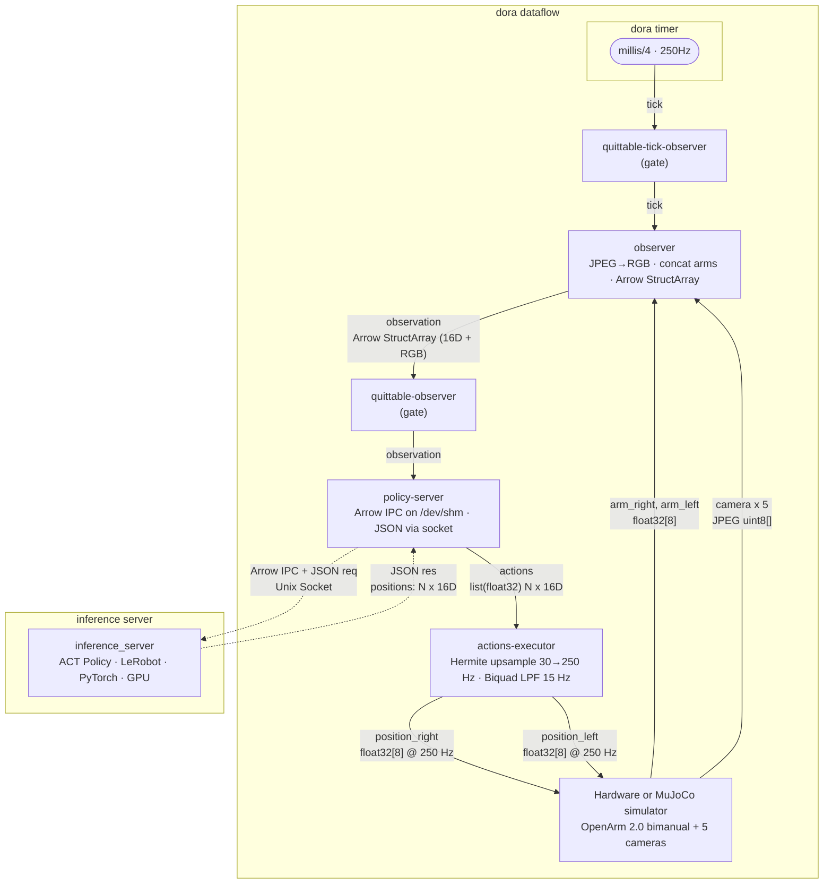

# Inference

---

## Overview

After training, a policy is deployed as a **policy server** process that:

1. Receives an observation bundle (cameras + joint positions) packed as an Arrow IPC file
2. Runs the model
3. Returns a JSON action chunk (a sequence of 16-DOF joint positions)

The robot runtime is a [Dora](https://dora-rs.ai/) dataflow.

---

## Dataflow Architecture


## The Policy Server Contract

This is the what one needs to implement when adapting to a new model.

### Transport

The node connects to a UNIX socket (path set via `$SOCKET`). The Dora node
`dora-openarm-local-policy-server` handles the socket I/O for you; your
model code lives in the process it launches.

For local development, the server listens on the socket:

```
SOCKET=/dev/shm/policy-server.socket dora run dataflow-inference.yaml --uv
```

### Observation Input

Each request arrives as a JSON line over the socket:

```json
{
  "name": "inference",
  "data_path": "/dev/shm/obs_12345.arrow",
  "metadata": {
    "timestamp": 1716000000123456789,
    "camera_head.height": 600,
    "camera_head.width": 960,
    "camera_ceiling.height": 600,
    "camera_ceiling.width": 960,
    "camera_wrist_right.height": 600,
    "camera_wrist_right.width": 960,
    "camera_wrist_left.height": 600,
    "camera_wrist_left.width": 960
  }
}
```

Open the Arrow IPC file and parse it:

```python
import pyarrow as pa
import numpy as np

with pa.OSFile(request["data_path"], "rb") as f:
    with pa.ipc.open_file(f) as reader:
        observations = reader.get_batch(0).to_struct_array()

last = observations[-1]
metadata = request["metadata"]

# Camera frames — shape (H, W, 3), uint8
def read_camera(name):
    return (
        last[name].values.to_numpy(zero_copy_only=False)
        .reshape(metadata[f"{name}.height"], metadata[f"{name}.width"], 3)
    )

frames = {
    "head":        read_camera("camera_head"),
    "ceiling":     read_camera("camera_ceiling"),
    "right_wrist": read_camera("camera_wrist_right"),
    "left_wrist":  read_camera("camera_wrist_left"),
}

# Joint positions — float32, shape (16,)
# Layout: right_arm[7] | right_gripper[1] | left_arm[7] | left_gripper[1]
pos_dim = len(last["position"])
qpos = (
    last["position"].values.to_numpy(zero_copy_only=False)
    .reshape(pos_dim)
    .astype(np.float32)
)
```

### Action Output

Write a single JSON line back to the socket:

```json
{
  "interval": 33333333,
  "cutoff_hz": 15,
  "positions": [
    [q0, q1, q2, q3, q4, q5, q6, q7, q8, q9, q10, q11, q12, q13, q14, q15],
    ...
  ]
}
```

| Field | Type | Meaning |
|---|---|---|
| `interval` | int (ns) | Time between consecutive position steps. `int(1e9 / 30)` ≈ 33 ms for 30 Hz |
| `cutoff_hz` | number, optional | The low-pass filter cutoff frequency (Hz) lower = smoother motion, higher = more responsive. |
| `positions` | `List[List[float]]` length T | Each inner list is 16 floats: `right_arm[7] + right_gripper[1] + left_arm[7] + left_gripper[1]` |

If you want to skip inference this tick (e.g. rate-limiting), return an empty positions list:

```json
{ "positions": [] }
```

---

## Dataflow YAML — Key Nodes

The three nodes you care about most in the YAML. Everything else (ticks, cameras,
arms) is boilerplate you copy verbatim.

```yaml
nodes:
  # --- observer: collects arms + cameras into one Arrow IPC bundle ---
  - id: observer
    path: dora-openarm-observer
    inputs:
      tick:               quittable-tick-observer/tick   # 30 Hz gate
      arm_right:          arm-right/position
      arm_left:           arm-left/position
      camera_wrist_right: camera-wrist-right/image
      camera_wrist_left:  camera-wrist-left/image
      camera_head:        camera-head/image
      camera_ceiling:     camera-ceiling/image
      phase_classifier_result: phase-classifier/result
    outputs:
      - observation   # Arrow IPC file path + metadata, written to /dev/shm

  # --- quittable-observer: gate controlled by controller ---
  - id: quittable-observer
    path: dora-openarm-quitter
    inputs:
      command:     controller/command
      observation: observer/observation
    outputs:
      - observation

  # --- policy-server: YOUR node ---
  - id: policy-server
    path: dora-openarm-local-policy-server
    env:
      SOCKET: /dev/shm/policy-server.socket   # must match your running server
    inputs:
      observation: quittable-observer/observation
    outputs:
      - actions   # JSON: {interval, cutoff_hz, positions: [[16D], ...]}

  # --- actions-executor: unpacks the chunk and drives the arms ---
  - id: actions-executor
    path: dora-openarm-actions-executor
    args: "--upsample-on --filter-on"
    inputs:
      actions: policy-server/actions
    outputs:
      - move_position_right   # → arm-right
      - move_position_left    # → arm-left
```

The `observation` output of `quittable-observer` is what your server receives as
`request["data_path"]`. The `actions` output is what you write back via the socket.

---

## Running Example

In order to understand the inference loop, let's run a simple example with lerobot ACT policy withy MuJoCo sim. 

The data is collected via [VR teleoperation](../data-collection.mdx) so you can also collect your own dataset and run inference on it.


### Prerequisites

* Python 3.10+
* uv
* CUDA-capable GPU (falls back to CPU/MPS but model inference and MuJoCo sim require GPU for good performance)

### Dataset and Model

* Dataset : https://huggingface.co/datasets/k1000dai/openarm_mujoco_pick_cube_3_cam

You can use this dataset to train lerobot ACT policy. 
Here is a sample training script for the ACT policy:

```bash
# Train ACT policy on the dataset with lerobot==0.3.3
lerobot-train \
  --dataset.repo_id=k1000dai/openarm_mujoco_pick_cube_3_cam \
  --policy.type=act \
  --output_dir=outputs/train \
  --policy.device=cuda \
  --wandb.enable=false \
  --policy.repo_id=$HF_USER/act_policy \
  --policy.push_to_hub False
```
For more details on training the ACT policy, please check the [LeRobot Documentation](https://huggingface.co/docs/lerobot/index).

For simplicity, we will use the trained model from Hugging Face Hub in this tutorial. 
This is the model trained on the above dataset with the above training script with 40k steps.

* Model : https://huggingface.co/k1000dai/act_openarm_pick_cube_40k

### Prepare the required dora nodes

You need to prepare the following dora nodes for running the inference dataflow:
* https://github.com/enactic/dora-openarm-actions-executor.git
* https://github.com/enactic/dora-openarm-mujoco.git
* https://github.com/enactic/dora-openarm-observer.git
* https://github.com/enactic/dora-openarm-quitter.git
* https://github.com/enactic/dora-openarm-local-policy-server.git
* https://github.com/enactic/dora-openarm-docker-policy-server.git


**TODO** commitの指定 (一応)
```bash
# Clone the repositories
mkdir dora-openarm-lerobot-inference
cd dora-openarm-lerobot-inference
git init
git submodule add https://github.com/enactic/dora-openarm-actions-executor.git nodes/dora-openarm-actions-executor
git submodule add https://github.com/enactic/dora-openarm-mujoco.git nodes/dora-openarm-mujoco
git submodule add https://github.com/enactic/dora-openarm-observer.git nodes/dora-openarm-observer
git submodule add https://github.com/enactic/dora-openarm-quitter.git nodes/dora-openarm-quitter
git submodule add https://github.com/enactic/dora-openarm-local-policy-server.git nodes/dora-openarm-local-policy-server
git submodule add https://github.com/enactic/dora-openarm-docker-policy-server.git nodes/dora-openarm-docker-policy-server
```

### A. local policy server (for debugging)

#### write the dataflow YAML

Here is a sample dataflow YAML for running the local policy server. 
The key nodes are `observer`, `quittable-observer`, `policy-server`, and `actions-executor`. The `mujoco-collect` node simulates the robot and cameras in MuJoCo, but you can replace it with the real robot nodes if you want to run on hardware.

And, `dora-openarm-local-policy-server` is the node that handles the socket communication with your local policy server.

<details>
<summary>sample dataflow YAML for local policy server</summary>

```yaml
nodes:
  # --- observer: collects arms + cameras into one Arrow IPC bundle ---
  - id: observer
    build: pip install -e  nodes/dora-openarm-observer
    path: dora-openarm-observer
    inputs:
      tick:               quittable-tick-observer/tick   # 30 Hz gate
      arm_right:          mujoco-collect/arm_right_observation
      arm_left:           mujoco-collect/arm_left_observation
      camera_wrist_right: mujoco-collect/camera_wrist_right
      camera_wrist_left:  mujoco-collect/camera_wrist_left
      camera_head_left:   mujoco-collect/camera_head_left
      camera_head_right:  mujoco-collect/camera_head_right
      camera_ceiling:     mujoco-collect/camera_ceiling
    outputs:
      - observation   # Arrow IPC file path + metadata, written to /dev/shm


  - id: quittable-tick-observer
    build: pip install -e nodes/dora-openarm-quitter
    # build: pip install dora-openarm-quitter
    path: dora-openarm-quitter
    inputs:
      # 250Hz
      tick: dora/timer/millis/4
    outputs:
      - tick

  # --- quittable-observer: gate controlled by controller ---
  - id: quittable-observer
    build: pip install -e nodes/dora-openarm-quitter
    path: dora-openarm-quitter
    inputs:
      observation: observer/observation
    outputs:
      - observation

  # --- policy-server: YOUR node ---
  - id: policy-server
    build: pip install -e nodes/dora-openarm-local-policy-server
    path: dora-openarm-local-policy-server
    env:
      SOCKET: /dev/shm/policy-server.socket   # must match your running server
    inputs:
      observation: quittable-observer/observation
    outputs:
      - actions   # JSON: {interval, cutoff_hz, positions: [[16D], ...]}

  # --- actions-executor: unpacks the chunk and drives the arms ---
  - id: actions-executor
    build: pip install -e nodes/dora-openarm-actions-executor
    path: dora-openarm-actions-executor
    args: "--upsample --filter"
    inputs:
      actions: policy-server/actions
    outputs:
      - move_position_right   # → arm-right
      - move_position_left    # → arm-left

  # ── MuJoCo viewer (replaces follower-right, follower-left, and all cameras) ──
  - id: mujoco-collect
    build: pip install -e nodes/dora-openarm-mujoco
    path: dora-openarm-mujoco
    args: "--scene demo --keyframe home --enable-collision --ctrl --viewer --render"
    inputs:
      position_left: actions-executor/move_position_left
      position_right: actions-executor/move_position_right
    outputs:
      - status
      - arm_right_observation
      - arm_left_observation
      - camera_wrist_right
      - camera_wrist_left
      - camera_head_left
      - camera_head_right
      - camera_ceiling
```

</details>

#### Prepare the policy server script

You need to setup the local policy server to load the model and run inference.

The sample local policy server script is provided [here](https://github.com/enactic/dora-openarm-local-policy-server/blob/main/example/openarm_local_policy_server_example/main.py).

Please modify the script to load the model from Hugging Face Hub and run inference on the incoming observation.

The sample script for the local policy server is also provided in the code snippet below.

<details>
<summary>sample code with lerobot ACT policy</summary>

```python
import json
import os
import socket
import sys

import numpy as np
import pyarrow as pa
import torch
from PIL import Image

from lerobot.policies.pretrained import PreTrainedConfig
from lerobot.policies.factory import get_policy_class

PRETRAINED_PATH = "k1000dai/act_openarm_pick_cube_40k"
DEFAULT_SOCKET = "/dev/shm/policy-server.socket"

CAMERA_KEY_MAP = {
    "camera_head_left": "observation.images.head_left",
    "camera_wrist_left": "observation.images.wrist_left",
    "camera_wrist_right": "observation.images.wrist_right",
}

IMAGE_SIZES: dict[str, tuple[int, int]] = {}

KNOWN_RESOLUTIONS = {
    600 * 960 * 3: (600, 960),
    720 * 1280 * 3: (720, 1280),
    480 * 640 * 3: (480, 640),
    1080 * 1920 * 3: (1080, 1920),
}

INTERVAL_NS = 33_333_333
CUTOFF_HZ = 15


def detect_resolution(n_bytes):
    if n_bytes in KNOWN_RESOLUTIONS:
        return KNOWN_RESOLUTIONS[n_bytes]
    n_pixels = n_bytes // 3
    for ratio_h, ratio_w in [(3, 4), (9, 16), (3, 5), (2, 3)]:
        h = int((n_pixels * ratio_h / ratio_w) ** 0.5)
        w = n_pixels // h
        if h * w == n_pixels:
            return (h, w)
    raise ValueError(f"Cannot determine resolution for {n_bytes} bytes")


def prepare_image(raw_data, target_h, target_w):
    data = raw_data.values.to_numpy().astype(np.uint8)
    src_h, src_w = detect_resolution(len(data))
    img = data.reshape(src_h, src_w, 3)
    if src_h != target_h or src_w != target_w:
        img = np.array(Image.fromarray(img).resize((target_w, target_h)))
    return torch.from_numpy(img).permute(2, 0, 1).float() / 255.0


def observation_to_batch(observation, device):
    batch = {}

    position = observation["position"].values.to_numpy().astype(np.float32)
    batch["observation.state"] = torch.from_numpy(position).unsqueeze(0).to(device)

    for arrow_key, model_key in CAMERA_KEY_MAP.items():
        target_h, target_w = IMAGE_SIZES[model_key]
        img = prepare_image(observation[arrow_key], target_h, target_w)

        # print(img.shape, img.dtype, img.is_contiguous(), img.stride()) for debugging
        batch[model_key] = img.unsqueeze(0).to(device)

    return batch


def infer(policy, observation, device):
    batch = observation_to_batch(observation, device)
    actions = policy.predict_action_chunk(batch)
    positions = actions.squeeze(0).cpu().numpy().tolist()
    return {
        "interval": INTERVAL_NS,
        "cutoff_hz": CUTOFF_HZ,
        "positions": positions,
    }


def main():
    socket_path = sys.argv[1] if len(sys.argv) > 1 else DEFAULT_SOCKET
    if torch.cuda.is_available():
        device = "cuda"
    elif torch.backends.mps.is_available():
        device = "mps"
    else:
        device = "cpu"

    print(f"Loading policy from {PRETRAINED_PATH} on {device}...")
    policy_config = PreTrainedConfig.from_pretrained(PRETRAINED_PATH)
    policy_config.pretrained_path = PRETRAINED_PATH
    kwargs = {}
    kwargs["config"] = policy_config
    kwargs["pretrained_name_or_path"] = policy_config.pretrained_path
    policy = get_policy_class(policy_config.type).from_pretrained(**kwargs)

    if device != policy.config.device:
        policy.to(device)
    policy.reset()

    for model_key in CAMERA_KEY_MAP.values():
        feature = policy.config.input_features[model_key]
        c, h, w = feature.shape
        IMAGE_SIZES[model_key] = (h, w)
    print(f"Policy loaded. Expected image sizes: {IMAGE_SIZES}")

    if os.path.exists(socket_path):
        os.remove(socket_path)

    print(f"Listening on {socket_path}")
    with socket.socket(socket.AF_UNIX, socket.SOCK_STREAM) as sock:
        sock.bind(socket_path)
        sock.listen()
        try:
            with sock.accept()[0] as conn:
                print("Connected")
                with conn.makefile("rw") as io:
                    for line in io:
                        request = json.loads(line)
                        with pa.OSFile(request["data_path"], "rb") as f:
                            with pa.ipc.open_file(f) as reader:
                                obs = reader.get_batch(0).to_struct_array()[0]
                        actions = infer(policy, obs, device)
                        io.write(json.dumps(actions) + "\n")
                        io.flush()
        finally:
            if os.path.exists(socket_path):
                os.remove(socket_path)


if __name__ == "__main__":
    main()
```

</details>

#### Run the dataflow and the policy server
We assume you write the dataflow YAML as `dataflow-inference.yaml` and the local policy server script as `src/local_policy_server.py`.

1. set up the local policy server:

```bash
uv venv .venv_server
source .venv_server/bin/activate
uv pip install lerobot==0.3.3 pyarrow
# uv pip install torch torchvision torchaudio --torch-backend=cu128 --upgrade  # for CUDA 12.8
python src/local_policy_server.py /dev/shm/policy-server.socket
``` 

2. In another terminal, run the dora dataflow:

```bash
uv venv .venv -p 3.12
uv pip install dora-rs-cli
source .venv/bin/activate
dora build dataflow-inference.yaml --uv
SOCKET=/dev/shm/policy-server.socket dora run dataflow-inference.yaml --uv
``` 
You should see the MuJoCo sim window open, and the robot should start moving according to the policy's actions.


### B. policy server in Docker 

#### write the dataflow YAML

The dataflow YAML is mostly the same as the local policy server version, except that you use `dora-openarm-docker-policy-server` instead of `dora-openarm-local-policy-server` and set the `IMAGE` environment variable to your Docker image.

Here we set `IMAGE: openarm-inference-image-lerobot:latest` as an example, but you should replace it with the actual image name of your policy server.

<details>
<summary>sample dataflow YAML for Docker-based policy server</summary>

```yaml
nodes:
  # --- observer: collects arms + cameras into one Arrow IPC bundle ---
  - id: observer
    build: pip install -e  nodes/dora-openarm-observer
    path: dora-openarm-observer
    inputs:
      tick:               quittable-tick-observer/tick   # 30 Hz gate
      arm_right:          mujoco-collect/arm_right_observation
      arm_left:           mujoco-collect/arm_left_observation
      camera_wrist_right: mujoco-collect/camera_wrist_right
      camera_wrist_left:  mujoco-collect/camera_wrist_left
      camera_head_left:   mujoco-collect/camera_head_left
      camera_head_right:  mujoco-collect/camera_head_right
      camera_ceiling:     mujoco-collect/camera_ceiling
    outputs:
      - observation   # Arrow IPC file path + metadata, written to /dev/shm


  - id: quittable-tick-observer
    build: pip install -e nodes/dora-openarm-quitter
    # build: pip install dora-openarm-quitter
    path: dora-openarm-quitter
    inputs:
      # 250Hz
      tick: dora/timer/millis/4
    outputs:
      - tick

  # --- quittable-observer: gate controlled by controller ---
  - id: quittable-observer
    build: pip install -e nodes/dora-openarm-quitter
    path: dora-openarm-quitter
    inputs:
      observation: observer/observation
    outputs:
      - observation

  # --- policy-server: Docker based inference ---
  - id: policy-server
    build: pip install -e nodes/dora-openarm-docker-policy-server
    path: dora-openarm-docker-policy-server
    env:
      IMAGE: openarm-inference-image-lerobot:latest
    inputs:
      observation: quittable-observer/observation
    outputs:
      - actions   # JSON: {interval, cutoff_hz, positions: [[16D], ...]}

  # --- actions-executor: unpacks the chunk and drives the arms ---
  - id: actions-executor
    build: pip install -e nodes/dora-openarm-actions-executor
    path: dora-openarm-actions-executor
    args: "--upsample --filter"
    inputs:
      actions: policy-server/actions
    outputs:
      - move_position_right   # → arm-right
      - move_position_left    # → arm-left

  # ── MuJoCo viewer (replaces follower-right, follower-left, and all cameras) ──
  - id: mujoco-collect
    build: pip install -e nodes/dora-openarm-mujoco
    path: dora-openarm-mujoco
    args: "--scene demo --keyframe home --enable-collision --ctrl --viewer --render"
    inputs:
      position_left: actions-executor/move_position_left
      position_right: actions-executor/move_position_right
    outputs:
      - status
      - arm_right_observation
      - arm_left_observation
      - camera_wrist_right
      - camera_wrist_left
      - camera_head_left
      - camera_head_right
      - camera_ceiling
```

</details>

Save the YAML as `dataflow-docker-inference.yaml`.

#### prepare the policy server Docker image

First, you need to write the policy server script that loads the model and runs inference, similar to the local policy server version. 

Sample code for the policy server script with Dcoker is provided [here](https://github.com/enactic/dora-openarm-docker-policy-server/blob/main/example/openarm_docker_policy_server_example/main.py)

<details>
<summary>sample docker server script with lerobot ACT policy</summary>
```python
"""Docker-based policy server for OpenArm inference with LeRobot."""
import json
import socket
import sys

import numpy as np
import pyarrow as pa
import torch
from PIL import Image

from lerobot.policies.factory import get_policy_class
from lerobot.policies.pretrained import PreTrainedConfig

PRETRAINED_PATH = "k1000dai/act_openarm_pick_cube_40k"

CAMERA_KEY_MAP = {
    "camera_head_left": "observation.images.head_left",
    "camera_wrist_left": "observation.images.wrist_left",
    "camera_wrist_right": "observation.images.wrist_right",
}

IMAGE_SIZES: dict[str, tuple[int, int]] = {}

KNOWN_RESOLUTIONS = {
    600 * 960 * 3: (600, 960),
    720 * 1280 * 3: (720, 1280),
    480 * 640 * 3: (480, 640),
    1080 * 1920 * 3: (1080, 1920),
}

INTERVAL_NS = 33_333_333
CUTOFF_HZ = 15


def detect_resolution(n_bytes):
    if n_bytes in KNOWN_RESOLUTIONS:
        return KNOWN_RESOLUTIONS[n_bytes]
    n_pixels = n_bytes // 3
    for ratio_h, ratio_w in [(3, 4), (9, 16), (3, 5), (2, 3)]:
        h = int((n_pixels * ratio_h / ratio_w) ** 0.5)
        w = n_pixels // h
        if h * w == n_pixels:
            return (h, w)
    raise ValueError(f"Cannot determine resolution for {n_bytes} bytes")


def prepare_image(raw_data, target_h, target_w):
    data = raw_data.values.to_numpy().astype(np.uint8)
    src_h, src_w = detect_resolution(len(data))
    img = data.reshape(src_h, src_w, 3)
    if src_h != target_h or src_w != target_w:
        img = np.array(Image.fromarray(img).resize((target_w, target_h)))
    return torch.from_numpy(img).permute(2, 0, 1).float() / 255.0


def observation_to_batch(observation, device):
    batch = {}

    position = observation["position"].values.to_numpy().astype(np.float32)
    batch["observation.state"] = torch.from_numpy(position).unsqueeze(0).to(device)

    for arrow_key, model_key in CAMERA_KEY_MAP.items():
        target_h, target_w = IMAGE_SIZES[model_key]
        img = prepare_image(observation[arrow_key], target_h, target_w)
        batch[model_key] = img.unsqueeze(0).to(device)

    return batch


def infer(policy, observation, device):
    batch = observation_to_batch(observation, device)
    actions = policy.predict_action_chunk(batch)
    positions = actions.squeeze(0).cpu().numpy().tolist()
    return {
        "interval": INTERVAL_NS,
        "cutoff_hz": CUTOFF_HZ,
        "positions": positions,
    }


def main():
    socket_path = sys.argv[1]

    if torch.cuda.is_available():
        device = "cuda"
    elif torch.backends.mps.is_available():
        device = "mps"
    else:
        device = "cpu"

    print(f"Loading policy from {PRETRAINED_PATH} on {device}...")
    policy_config = PreTrainedConfig.from_pretrained(PRETRAINED_PATH)
    policy_config.pretrained_path = PRETRAINED_PATH
    policy = get_policy_class(policy_config.type).from_pretrained(
        config=policy_config,
        pretrained_name_or_path=policy_config.pretrained_path,
    )

    if device != policy.config.device:
        policy.to(device)
    policy.reset()

    for model_key in CAMERA_KEY_MAP.values():
        feature = policy.config.input_features[model_key]
        c, h, w = feature.shape
        IMAGE_SIZES[model_key] = (h, w)
    print(f"Policy loaded. Expected image sizes: {IMAGE_SIZES}")

    print(f"Connecting to {socket_path}...")
    with socket.socket(socket.AF_UNIX, socket.SOCK_STREAM) as sock:
        sock.connect(socket_path)
        with sock.makefile("rw") as io:
            for line in io:
                request = json.loads(line)
                with pa.OSFile(request["data_path"], "rb") as f:
                    with pa.ipc.open_file(f) as reader:
                        obs = reader.get_batch(0).to_struct_array()[0]
                actions = infer(policy, obs, device)
                io.write(json.dumps(actions) + "\n")
                io.flush()


if __name__ == "__main__":
    main()
```

</details>

After you prepare the server script, we need to build a Docker image that contains the script and the model. You can use the [following Dockerfile](https://github.com/enactic/dora-openarm-docker-policy-server/blob/main/example/Dockerfile) as a reference.

We assume you save the python script as `src/docker_policy_server.py`.


<details>
<summary>sample Dockerfile with above server script</summary>

```
FROM ghcr.io/astral-sh/uv:0.11.16 AS uv
FROM python:3.12

SHELL ["/bin/bash", "-c"]
WORKDIR /project

COPY --from=uv /uv /uvx /bin/
COPY src/ src/

RUN uv venv .venv 
RUN uv pip install lerobot==0.3.3 pyarrow
# For CUDA 12.8, use the following line instead to install PyTorch with CUDA support. Make sure to match the CUDA version with your host machine.
#RUN uv pip install torch torchvision --torch-backend=cu128 --upgrade

ENV VIRTUAL_ENV=/project/.venv \
    PATH="/project/.venv/bin:$PATH"

RUN python -c "\
from lerobot.policies.pretrained import PreTrainedConfig; \
from lerobot.policies.factory import get_policy_class; \
cfg = PreTrainedConfig.from_pretrained('k1000dai/act_openarm_pick_cube_40k'); \
cfg.pretrained_path = 'k1000dai/act_openarm_pick_cube_40k'; \
get_policy_class(cfg.type).from_pretrained(config=cfg, pretrained_name_or_path=cfg.pretrained_path)" \
    && python -c "import torchvision; torchvision.models.resnet18(weights=torchvision.models.ResNet18_Weights.DEFAULT)"

ENV HF_HUB_OFFLINE=1

ENTRYPOINT ["python", "src/docker_policy_server.py"]
```

</details>

Build the Docker image:

```bash
docker build -t openarm-inference-image-lerobot:latest .
```

Now you can run the dataflow with the Docker-based policy server. Make sure to set the `IMAGE` environment variable in the dataflow YAML to the name of your Docker image.

```bash
dora build dataflow-docker-inference.yaml --uv
dora run dataflow-docker-inference.yaml --uv
```
